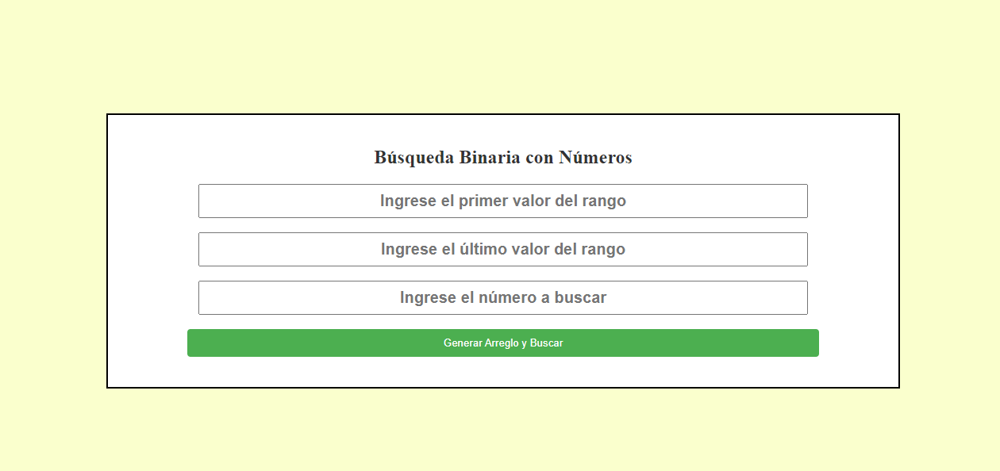
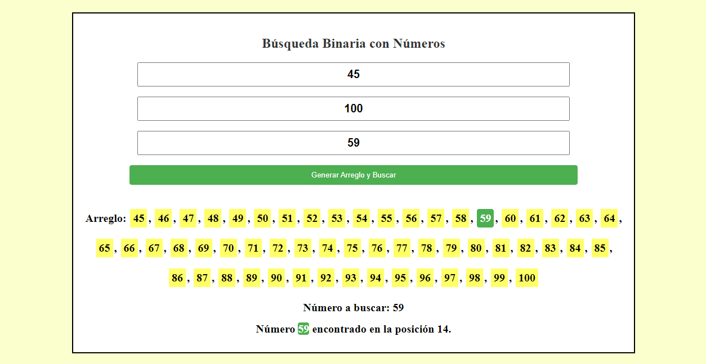
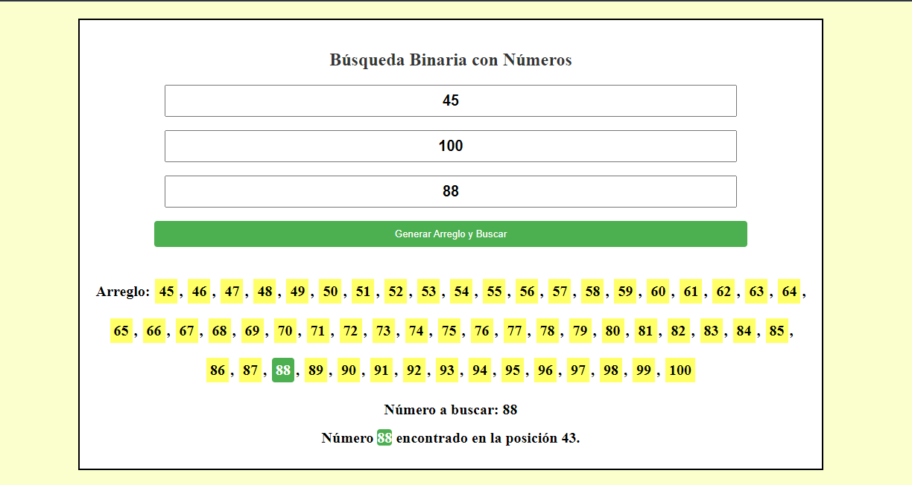

# Búsqueda Binaria con Rango de Datos

ℹ️ **Descripción**
Este proyecto presenta una implementación de la búsqueda binaria en JavaScript. En esta versión, el usuario puede definir un rango específico de números para realizar la búsqueda, lo que brinda mayor flexibilidad al generar un arreglo dinámico.

📋 **Contenido**
- [Estructura del Proyecto](#estructura-del-proyecto)
- [Funcionamiento](#funcionamiento)
- [Estilos CSS](#estilos-css)
- [JavaScript](#javascript)
- [Instrucciones de Uso](#instrucciones-de-uso)
- [Imágenes de la Aplicación](#imágenes-de-la-aplicación)
- [Contribución](#contribución)
- [Licencia](#licencia)

## Estructura del Proyecto

### HTML 🌐
El archivo HTML establece la estructura de la aplicación, proporcionando elementos de entrada y resultados visuales.

### Estilos CSS 🎨
El CSS define los estilos visuales para la interfaz de usuario, incluyendo colores, tamaños y disposición de los elementos.

### JavaScript 🧩
El código JavaScript contiene la lógica de la búsqueda binaria. Implementa la función `busquedaBinaria` para buscar el número ingresado por el usuario dentro del rango definido.

## Funcionamiento

La búsqueda binaria es un algoritmo eficiente para encontrar un elemento en un arreglo ordenado. Divide el segmento de búsqueda a la mitad y ajusta el segmento en función de la comparación con el elemento en la mitad del arreglo.

### Instrucciones de Uso

1. Ingresa un rango de números en los campos de inicio y fin.
2. Ingresa el número a buscar en el campo correspondiente.
3. Haz clic en el botón "Generar Arreglo y Buscar".
4. Se mostrará la lista de números y el resultado de la búsqueda.

## Imágenes de la Aplicación

## Contribución

¡Las contribuciones son bienvenidas! Si tienes sugerencias o mejoras, no dudes en abrir un issue o una pull request.

## Licencia

Este proyecto está bajo la Licencia MIT - consulta el archivo [LICENSE.md](LICENSE.md) para más detalles.
